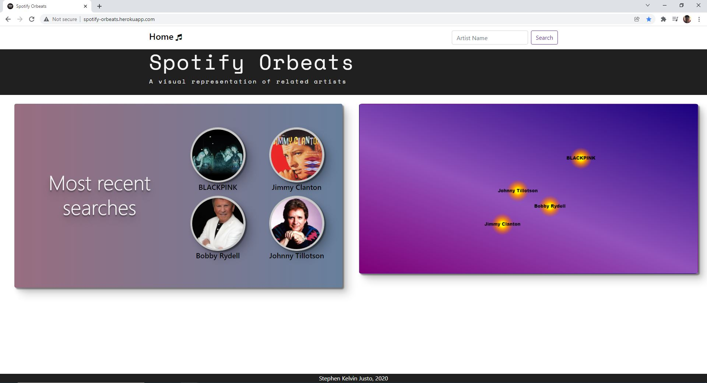
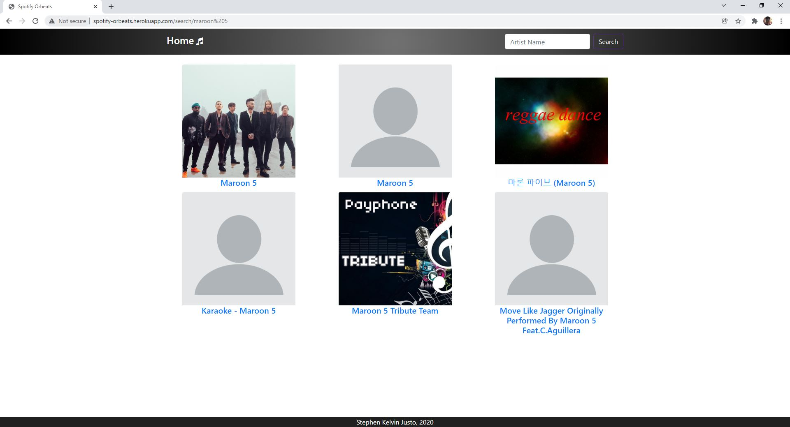
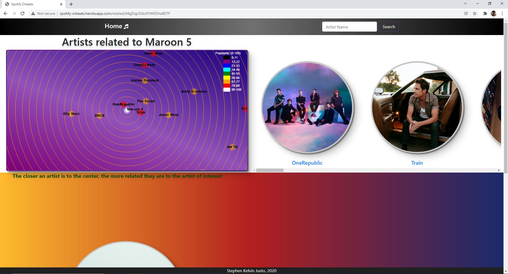
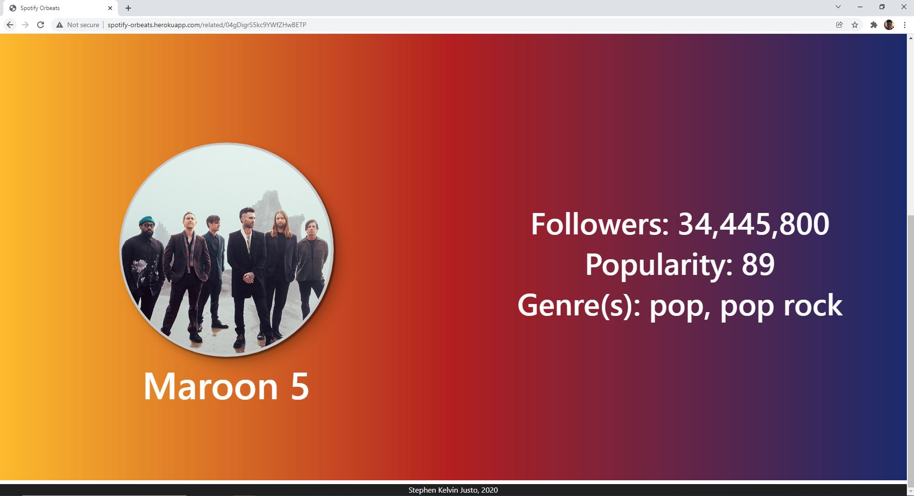

<h2 align="center">Spotify Orbeats</h3>

A magnificent representation of Spotify's related artists

### [Demo - Check out the application here](http://spotify-orbeats.herokuapp.com/)

## What's Spotify Orbeats?

**A web application built using ExpressJS that accesses the Spotify API and visualizes their data on related artists.**

- Search for your favorite artists
- Learn how popular your favorite artist is on Spotify
- Find similar artists

### Demo and Screenshots

  <h3 align="center">Home</h3>
  
  <h3 align="center">Searching</h3>
  
  
  <h3 align="center">Related Artists</h3>
  
  
  <h3 align="center">Graph</h3>
  
  

    The artist of interest is always displayed on the center of the canvas with the related artists revolving around them. Additionally,
    the colors of the artists represent their popularities. The colors from the least popular to most popular are black, purple, blue, cyan, 
    green, yellow, orange, red, and white.
  

The application also utilizes MongoDB to keep track of users' most recent searches and the authorization tokens required to access the Spotify API.
